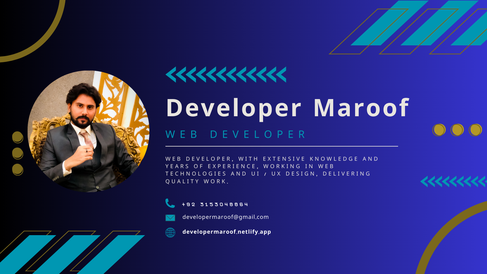

# Hi 👋, I'm Maroof Qureshi

### I'm a passionate | Web Developer | from Pakistan

A seasoned professional in web technologies and UI/UX development, my extensive experience and knowledge ensure the consistent delivery of exceptional results, setting a high standard for quality and innovation in every project I undertake.

Web developer, with extensive knowledge and years of experience, working on web technologies and UI/UX design, delivering quality work.

- Successfully Completed 65+ Projects
- Continuously expanding skill set through Self-Study and keeping up-to-date with the latest Web Development Trends

## Bachelor of Science

University of Sindh | 2021-2024

## 💼 Working Experience

### (Devnito)####📍 Dubai,United Arab Emirates

- (Frontend Developer)

## 🤖 Technologies I Know

- HTML
- CSS
- JavaScript
- React JS
- Firebase
- Redux
- TypeScript
- API Integration
- Styling (Tailwind CSS, Bootstrap, Scss/Sass)
- Project Management (Git, Github)
- Design (Canva)
- Deployment (Netlify)
